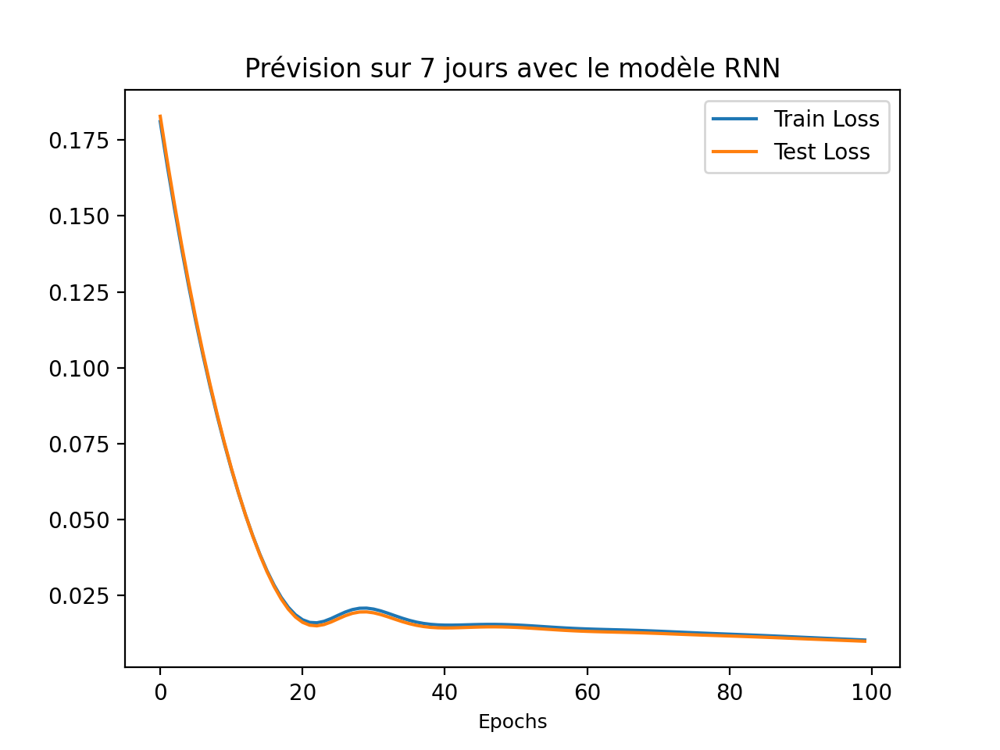
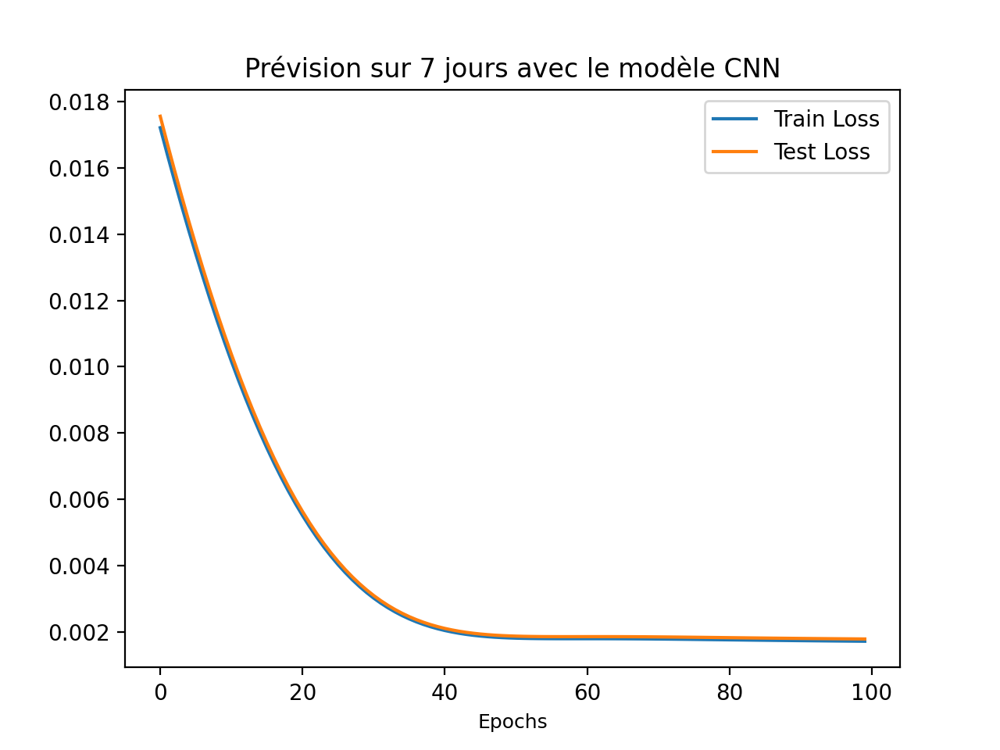

# DeepL_TP2
## Introduction
Le travail réalisé consiste à prédire la température d'une date sachant celle des 7 jours
précédents. Pour ce faire, deux modèles ont été utilisés: Le modèle RNN et le modèle CNN.

Le problème auquel on s'est intéréssé est alors de savoir entre les deux modèles, lequel est
le plus performant pour le type de données dont nous disposons.
## Expériences réalisées et paramètres
Pour faire la prédiction, des données météo de 2019 et de 2020 qui contiennent des températures
moyennes journalières on été utilisées. 

Les données de 2019 ont servies de bases d'entrainement pour les modèles alors que les données de 
2020 ont été utilisées comme données de test.

Lors des différentes expériences, notre attention s'est focalisée sur les loss d'entrainement et de validation 
(mesurée lors des tests) au cours des différentes epochs d'entrainement.

Les paramètres suivants ont été communs aux deux expériences:

- 100 epochs d'entrainement => de test
- 0.001 de taux d'apprentissage
- Adam comme optimiseur
- Erreur des moindres carrées comme erreur

Plus particulièrement, on a les paramètres suivants par modèle:
#### RNN
Le modèle a été conçu avec 20 couches cachées linéaires
#### CNN
Le modèle est un modèle séquentiel qui combine une couche convolutionnelle à une dimension avec un noyau de taille 7 
et un stride de 1 avec une fonction d'activation de type ReLU.
## Résultats et comparaison des deux modèles
### Résultats

### Comparaison

## Conclusion de l'étude