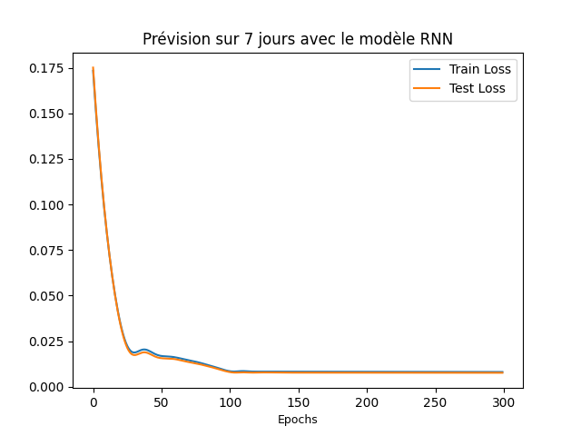
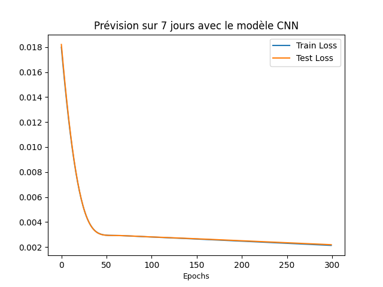
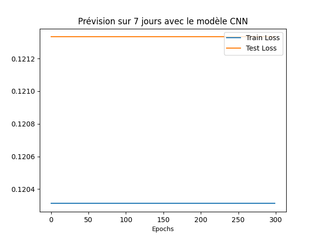

# DeepL_TP2

## Introduction

Le travail réalisé consiste à prédire la température d'une date sachant celle des 7 jours
précédents. Pour ce faire, deux modèles ont été utilisés: Le modèle RNN et le modèle CNN.

Le problème auquel on s'est intéréssé est alors de savoir entre les deux modèles, lequel est
le plus performant pour le type de données dont nous disposons.

## Expériences réalisées et paramètres

Pour faire la prédiction, des données météo de 2019 et de 2020 qui contiennent des températures
moyennes journalières on été utilisées.

Les données de 2019 ont servies de bases d'entrainement pour les modèles alors que les données de
2020 ont été utilisées comme données de test.

Lors des différentes expériences, notre attention s'est focalisée sur les loss d'entrainement et de validation
(mesurée lors des tests) au cours des différentes epochs d'entrainement.

Les paramètres suivants ont été communs aux deux expériences:

- 300 epochs d'entrainement => de test
- 0.001 de taux d'apprentissage
- Adam comme optimiseur
- Erreur des moindres carrées comme erreur

Plus particulièrement, on a les paramètres suivants par modèle:

#### RNN

Le modèle a été conçu avec 20 couches cachées linéaires

#### CNN

Le modèle est un modèle séquentiel qui combine une couche convolutionnelle à une dimension avec un noyau de taille 7
et un stride de 1 avec une fonction d'activation de type ReLU.

## Résultats et comparaison des deux modèles

### Résultats

### Comparaison

L'état de l'art montre que le modèle RNN est plus capable de traiter les problèmes dont les données sont séquentielles. 
Le CNN, quand à lui, est plus performant au niveau des données spatiales (les images).

#### Quelques points de comparaison

- Par rapport à la durée :

On remarque que l'entrainement du RNN prend plus du temps par rapport à celui du CNN;
En effet, l'entrainement du modèle CNN a duré en moyenne moins d'une demi seconde alors que celui du RNN 
durait jusqu'à 12 secondes. 

L'entraînement du modèle CNN est 6 fois plus rapide en moyenne.

- Par rapport au test loss :

Après avoir lancé plusieurs fois l'entrainement des deux modèles, on remarque qu'avec le CNN on aboutit souvent à une valeur minimale de test loss inférieure à la valeur finale de test loss du RNN.
Avec 300 comme nombre d'epochs, on remarque également que pour le CNN, la test loss continue à diminuer après ces 300 epochs
alors que dans le cas du RNN , la courbe se stabilise au bout de 200 epochs.

### Difficulté(s)

Parfois, en lancant l'entrainement du modèle de CNN , on avait comme résultat :

Ce qui veut dire que le modèle n'apprenait presque rien. En relancant l'apprentissage , on aboutit à des meilleurs résultats (voir l'image d'avant).

Ce comportement est peut-être dû à une erreur dans la conception du modèle, ou à phénomène que nous ignorons. 
En lisant un peu sur internet, certains disent que ce type de comportement arrive des fois lorsqu'on rencontre des phénomènes
de marche aléatoire (_random walk_) ou lorsqu'on a pas assez de couches. Ce qu'on trouve bizarre c'est que ça n'arrive que peu souvent.

Nous n'avons pas réussi à trouver d'explication de ce qui provoque ce comportement.

## Conclusion de l'étude
